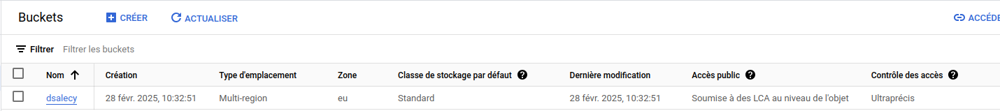

# DS GCP

------
Alexy Fouconnier
-------
### Création d'un Service Account :
**Étapes pour créer un Service Account dans GCP :**
1. **Accéder à la console GCP** : Connectez-vous à la console Google Cloud.
2. **Naviguer vers IAM & Admin** : Dans le menu de gauche, sélectionnez "IAM & Admin" puis "Service Accounts".
3. **Créer un Service Account** : Cliquez sur "Créer un compte de service".
4. **Remplir les détails** : Donnez un nom au Service Account et une description optionnelle.
5. **Attribuer des rôles** : Assignez les rôles IAM nécessaires pour ce Service Account.
6. **Créer des clés** : Après la création, vous pouvez générer une clé JSON ou P12 pour l'authentification.

**Bonnes pratiques en matière de gestion des clés et de sécurité :**
- **Rotation des clés** : Changez régulièrement les clés pour minimiser les risques en cas de compromission.
- **Limiter les permissions** : Appliquez le principe du moindre privilège en n'accordant que les permissions nécessaires.
- **Audit et monitoring** : Utilisez les outils de GCP pour surveiller l'utilisation des clés et détecter les activités anormales.
- **Stockage sécurisé** : Stockez les clés dans un endroit sûr, comme un gestionnaire de secrets, et ne les intégrez pas directement dans le code source.

### Création d'un Bucket :
**Comment créer un bucket sur Google Cloud Storage :**
1. **Accéder à Google Cloud Storage** : Dans la console GCP, allez à "Storage" puis "Browser".
2. **Créer un bucket** : Cliquez sur "Créer un bucket".
3. **Nommer le bucket** : Choisissez un nom unique globalement.
4. **Choisir la localisation** : Sélectionnez une région ou une multi-région pour stocker les données.
5. **Définir la classe de stockage** : Choisissez entre Standard, Nearline, Coldline, ou Archive selon vos besoins d'accès et de coût.
6. **Configurer les politiques de conservation** : Définissez des règles pour la rétention des données et la suppression automatique.

**Impact sur la sécurité et la performance :**
- **Localisation** : Affecte la latence et la conformité aux régulations locales.
- **Classe de stockage** : Influence les coûts et la rapidité d'accès aux données.
- **Politiques de conservation** : Aide à prévenir la perte de données et à se conformer aux exigences légales.

### Gestion des droits (IAM) :
**Gestion des identités et des accès (IAM) sur GCP :**
IAM permet de contrôler qui a quel accès à quelles ressources dans GCP. Les permissions sont accordées via des rôles qui peuvent être assignés à des utilisateurs, des groupes, ou des Service Accounts.

**Exemple de configuration des droits :**
Pour limiter l'accès à une base de données critique, vous pourriez créer un rôle personnalisé avec uniquement les permissions nécessaires pour lire les données, et assigner ce rôle à un groupe spécifique d'utilisateurs.

### Configuration de la facturation :
**Comment configurer la facturation sur GCP :**
1. **Créer un compte de facturation** : Liez un compte de paiement à votre projet GCP.
2. **Configurer les budgets et alertes** : Définissez des budgets pour surveiller les dépenses et configurez des alertes pour être notifié des dépassements.
3. **Utiliser des rapports de facturation** : Analysez les coûts et les tendances pour mieux comprendre et gérer les dépenses.

**Précautions pour éviter des coûts imprévus :**
- **Surveillance continue** : Utilisez les outils de monitoring pour suivre les dépenses en temps réel.
- **Limiter les ressources** : Mettez en place des quotas et des limites pour éviter l'utilisation excessive de ressources.
- **Optimiser les ressources** : Arrêtez ou redimensionnez les ressources inutilisées ou sous-utilisées.

### Regles de vie :
**La chose importante que l'on dit à la fin du cours en quittant la salle de TP :**
"Au revoir et bonne fin de journée"

-------

# TP
-------
lien repo git : https://github.com/Thefoxeen/Alexy-Fouconnier-mon-projet-gcp
-------
### Création du bucket :

```bash
gcloud storage buckets create gs://dsalecy --location=EU
```


